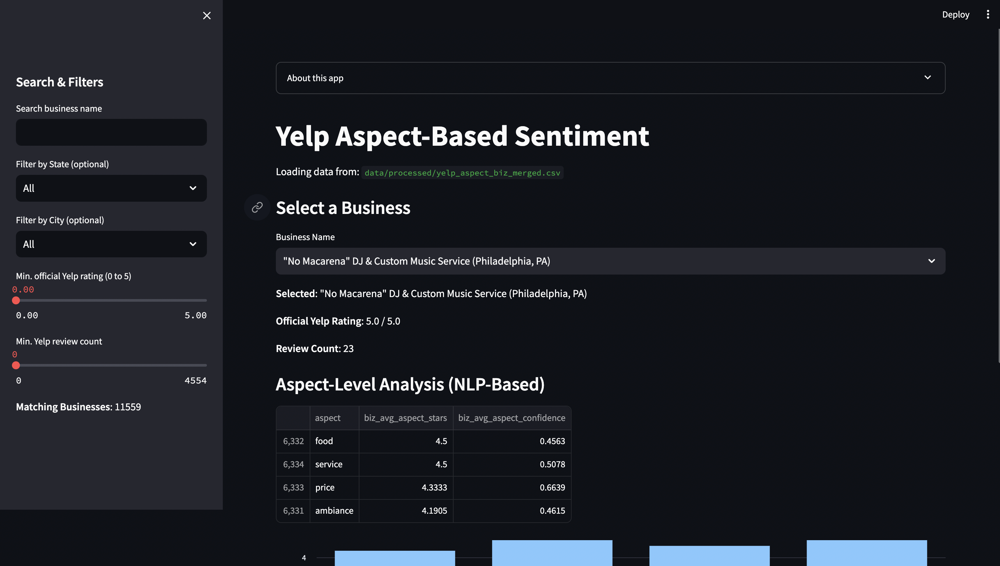
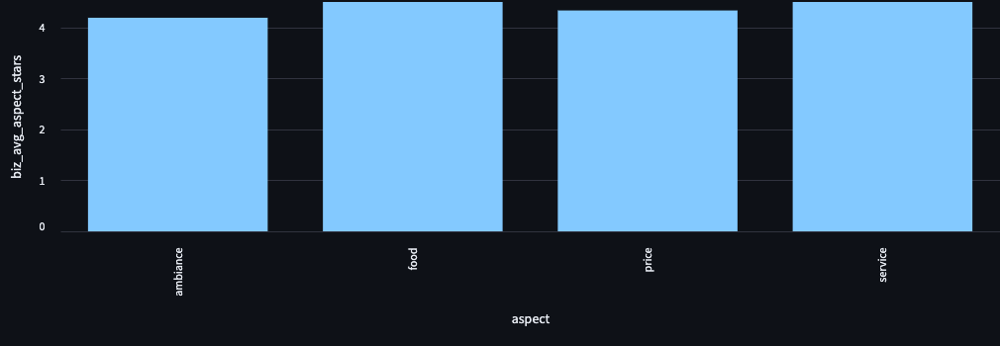

# ABSA-Maps Sentiment Analysis

Aspect-Based Sentiment Analysis (**ABSA**) on Yelp reviews. This project extracts *why* a place is good or bad (e.g., food, service, price, ambiance) using advanced **NLP** (Hugging Face transformers) and offers an interactive **Streamlit** dashboard for quick insights.

---

## Table of Contents

1. [Overview](#overview)  
2. [Features](#features)  
3. [Data Pipeline](#data-pipeline)  
4. [Project Structure](#project-structure)  
5. [Installation & Setup](#installation--setup)  
6. [Usage](#usage)  
   - [Data Preprocessing](#1-data-preprocessing)  
   - [Aspect-Based Sentiment](#2-aspect-based-sentiment)  
   - [Aggregation & Merging](#3-aggregation--merging)  
   - [Streamlit App](#4-streamlit-app)  
7. [Example Screenshots](#example-screenshots)  
8. [Performance & Limitations](#performance--limitations)  
9. [Roadmap & Future Work](#roadmap--future-work)  
10. [Contributing](#contributing)  
11. [License](#license)  
12. [Acknowledgements](#acknowledgements)  

---

## Overview

**ABSA-Maps** (Aspect-Based Sentiment for “Maps”) is a proof-of-concept application that analyzes Yelp reviews at an **aspect** level to help users understand *why* a place is good or bad. Rather than simply providing a single sentiment score, the system identifies aspects like **food**, **service**, **ambiance**, and **price** and assigns a separate sentiment rating for each.

Key goals:

- **Fine-Grained Insight**: Go beyond overall ratings to highlight specific strengths/weaknesses.  
- **NLP Pipeline**: Leverage **Hugging Face** transformers (`nlptown/bert-base-multilingual-uncased-sentiment`) for star-based sentiment.  
- **Interactive UI**: A **Streamlit** dashboard lets users filter businesses by name, city, state, official Yelp rating, and more—viewing both official Yelp data and the NLP-based aspect ratings.

---

## Features

- **End-to-End Pipeline**: Data cleaning, chunked sentiment analysis, aspect extraction, and final aggregation.  
- **Dictionary-Based Aspect Extraction**: Quickly map sentences to aspects via keyword matching.  
- **Transformer-Based Sentiment**: Automatically assigns star ratings (1–5 stars) at the sentence level.  
- **Aggregation**: Summarize aspect ratings per review and per business.  
- **Integration with Yelp Business Data**: Merge official Yelp average rating, review counts, city/state, etc.  
- **Streamlit Dashboard**: Search by business name, apply min rating or min review count filters, select city or state, and see aspect-based scores on a bar chart.

---

## Data Pipeline

1. **Data Ingestion**  
   - [Yelp Academic Dataset](https://www.yelp.com/dataset) – `yelp_academic_dataset_review.json` (reviews) and `yelp_academic_dataset_business.json` (business info).

2. **Preprocessing**  
   - Remove duplicates, short reviews, and possibly non-English text.  
   - Save cleaned data to `data/processed`.

3. **Aspect-Based Sentiment**  
   - Split reviews into sentences.  
   - Detect aspects (food, service, ambiance, price, etc.) using a keyword dictionary.  
   - Use the Hugging Face model `nlptown/bert-base-multilingual-uncased-sentiment` to assign star ratings to each sentence mentioning an aspect.

4. **Aggregation**  
   - Combine sentence-level aspect ratings → **review-level** (average aspect score).  
   - Combine review-level → **business-level** (average aspect score across all reviews for that business).

5. **Merge with Business Metadata**  
   - Attach official Yelp rating (`stars`), `review_count`, name, city, state, etc.

6. **Visualization (Streamlit)**  
   - Explore final data in an **interactive** interface.

---

## Project Structure

```
ABSA-Sentiment-Project/
├── data/
│   ├── raw/                  # Original Yelp JSON data (ignored or partially tracked in Git)
│   ├── processed/            # Cleaned/aggregated CSVs for the pipeline
├── notebooks/
│   └── EDA_yelp_hf_sentiment.ipynb   # Example Exploratory Data Analysis
├── src/
│   ├── data_preprocessing.py         # Cleans & filters Yelp review data
│   ├── hf_sentiment.py               # Example older script for chunk-based sentiment
│   ├── aspect_sentiment_pipeline.py  # Main script for dictionary-based aspect extraction + HF model
│   ├── aggregate_aspects.py          # Aggregates aspect-level ratings (review-level, business-level)
│   ├── merge_business_info.py        # Merges aggregated aspects with Yelp business metadata
│   └── utils.py                      # Helper functions (if any)
├── streamlit_app/
│   └── app.py                # Streamlit UI
├── requirements.txt          # Python dependencies
├── .gitignore
└── README.md                 # Project documentation (this file)
```

---

## Installation & Setup

1. **Clone the Repo**:
   ```bash
   git clone https://github.com/<your-username>/ABSA-Sentiment-Project.git
   cd ABSA-Sentiment-Project
   ```

2. **Create a Virtual Environment** (conda or venv):
   ```bash
   conda create -n absa python=3.9
   conda activate absa
   ```
   or
   ```bash
   python -m venv venv
   source venv/bin/activate  # Mac/Linux
   # On Windows:
   # venv\Scripts\activate
   ```

3. **Install Requirements**:
   ```bash
   pip install -r requirements.txt
   ```

4. **(Optional) Download NLTK Data**:
   ```bash
   python -m nltk.downloader punkt
   ```
   Needed if you use NLTK’s sentence tokenization.

5. **Ensure Data Availability**:
   - Place `yelp_academic_dataset_review.json` & `yelp_academic_dataset_business.json` in `data/raw/`.
   - Or use a **sample** CSV for demonstration.

---

## Usage

Below is the **typical workflow** to replicate the entire pipeline. Adjust file paths as needed:

### 1. Data Preprocessing

Cleans and filters Yelp review data. Example:

```bash
python src/data_preprocessing.py
```
- Reads from `data/raw/yelp_academic_dataset_review.json`.
- Produces something like `data/processed/yelp_reviews_cleaned.csv`.

### 2. Aspect-Based Sentiment

Runs the dictionary-based approach + Hugging Face star sentiment. Example:

```bash
python src/aspect_sentiment_pipeline.py
```

- Reads `data/processed/yelp_reviews_cleaned.csv` in chunks.
- Outputs `data/processed/yelp_aspect_sentiment.csv` with aspect-level row per **(review, sentence)**.

### 3. Aggregation & Merging

1. **Aggregate** at review-level, then business-level:
   ```bash
   python src/aggregate_aspects.py
   ```
   Produces `yelp_aspect_agg_review.csv`, then `yelp_aspect_agg_business.csv`.

2. **Merge** with Yelp business metadata:
   ```bash
   python src/merge_business_info.py
   ```
   Produces `yelp_aspect_biz_merged.csv`, containing columns like:  
   ```
   business_id, name, city, state, stars, review_count, aspect, biz_avg_aspect_stars, biz_avg_aspect_confidence
   ```

### 4. Streamlit App

Launch the **interactive dashboard**:

```bash
streamlit run streamlit_app/app.py
```
- Opens a local server (default: http://localhost:8501).
- Allows you to search/filter by business name, city/state, minimum rating, and see aspect-level scores.

---

## Example Screenshots

*(Replace placeholders with your actual images.)*

1. **Main Dashboard**  
   

2. **Aspect Bar Chart**  
   

---

## Performance & Limitations

- **Large Dataset**: The Yelp dataset can exceed 7M reviews. Running a transformer model on each sentence is computationally expensive. Consider:
  - Sampling fewer reviews for a proof-of-concept.  
  - Using GPU instances or parallelization (Spark, Dask).
- **Dictionary-Based Aspect Extraction**: Basic approach can miss synonyms or edge cases.  
- **Potential Data Issues**: The official API or scraping must respect Yelp TOS. This project relies on the [Yelp Academic Dataset](https://www.yelp.com/dataset).

---

## Roadmap & Future Work

- **Unsupervised Topic Modeling**: Use [BERTopic](https://github.com/MaartenGr/BERTopic) or LDA to discover new aspects.  
- **Parallelization**: Distribute sentiment analysis on Spark or Dask for full-scale runs.  
- **Deeper NLP**: Implement advanced aspect-based sentiment models (supervised or zero-shot).  
- **Deployment**: Host the Streamlit app on [Streamlit Cloud](https://streamlit.io/cloud) or a cloud VM.  
- **UI Enhancements**: Add multi-page navigation, advanced charts, or a “compare businesses” feature.

---

## Contributing

Contributions are welcome! If you’d like to submit a feature request or bug fix:
1. **Fork** the repository.  
2. **Create** a new feature branch (`git checkout -b feature/amazing-feature`).  
3. **Commit** your changes.  
4. **Open** a pull request on GitHub.

---

## License

This project is licensed under the **MIT License** – see the [LICENSE](LICENSE) file for details.

---

## Acknowledgements

- **Yelp** for providing the [Yelp Academic Dataset](https://www.yelp.com/dataset).  
- **Hugging Face** for the [transformers library](https://github.com/huggingface/transformers).  
- **Streamlit** for the rapid web app framework.  
- All open-source contributors who help improve the field of NLP.

---

### Thank You!

Enjoy exploring the **ABSA-Maps Sentiment** project. For questions or suggestions, please open an issue or reach out to me directly. Happy analyzing!
